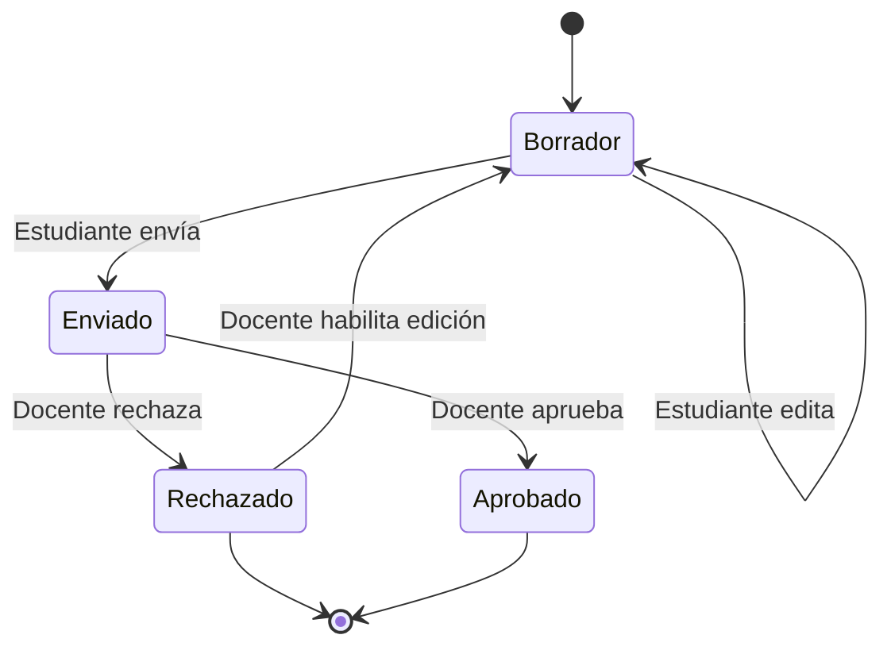
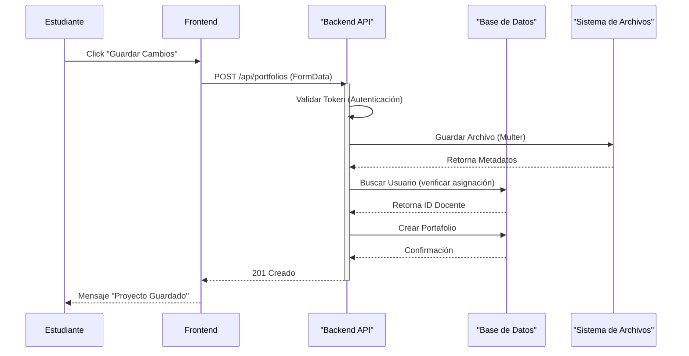
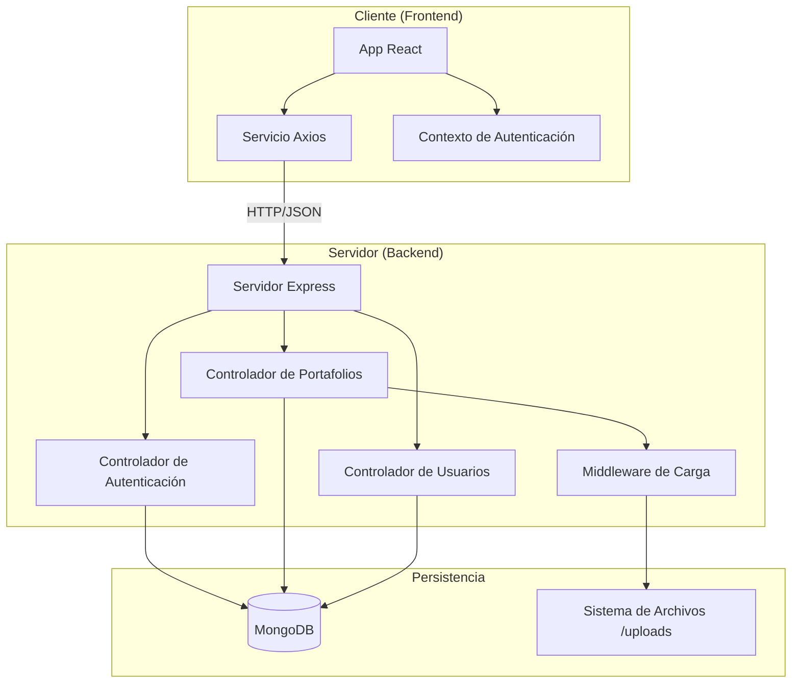
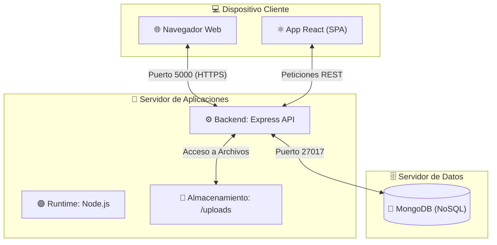

# 📊 Diagramas del Sistema SGP (Mermaid)

Este documento contiene la definición técnica de los diagramas del sistema.

---

## 1️⃣ Diagrama de Casos de Uso
Describe las funcionalidades disponibles para cada rol (Actor) y sus interacciones con el sistema.

```mermaid
graph TD
    %% Estilos Globales
    classDef actor fill:#ffffff,stroke:#000000,stroke-width:2px;
    classDef usecase fill:#ffffff,stroke:#000000,stroke-width:1px,rx:20,ry:20;

    %% Actores
    Estudiante["👤<br/>Estudiante"]:::actor
    Docente["👤<br/>Docente"]:::actor
    Coordinador["👤<br/>Coordinador"]:::actor

    %% Límite del Sistema
    subgraph Sistema ["Sistema de Gestión de Portafolios"]
        direction TB
        
        %% Grupo Acceso
        UC1([Registrarse]):::usecase
        UC2([Iniciar Sesión]):::usecase
        UC3([Recuperar Contraseña]):::usecase
        
        %% Grupo Estudiante
        UC4([Crear Portafolio]):::usecase
        UC5([Subir Archivos]):::usecase
        UC6([Enviar a Revisión]):::usecase
        UC7([Ver Mis Portafolios]):::usecase
        
        %% Grupo Docente
        UC8([Ver Asignados]):::usecase
        UC9([Descargar Archivo]):::usecase
        UC10([Evaluar Proyecto]):::usecase
        UC11([Realizar Observaciones]):::usecase
        
        %% Grupo Coordinador
        UC12([Ver Estadísticas]):::usecase
        UC13([Gestionar Asignaciones]):::usecase
        UC14([Listar Todos]):::usecase
    end
    
    %% Relaciones
    Estudiante --> UC1
    Estudiante --> UC2
    Estudiante --> UC3
    Estudiante --> UC4
    Estudiante --> UC5
    Estudiante --> UC6
    Estudiante --> UC7
    Estudiante --> UC9

    Docente --> UC2
    Docente --> UC3
    Docente --> UC8
    Docente --> UC9
    Docente --> UC10
    Docente --> UC11

    Coordinador --> UC2
    Coordinador --> UC3
    Coordinador --> UC9
    Coordinador --> UC12
    Coordinador --> UC13
    Coordinador --> UC14
```

---

## 2️⃣ Diagrama de Clases
Representa la estructura de datos (Modelo) y las relaciones entre entidades.

---

## 3️⃣ Diagrama de Estados (Portafolio)
Muestra el ciclo de vida de un proyecto académico.

---

## 4️⃣ Diagrama de Secuencia (Envío de Portafolio)
Detalla la interacción temporal de objetos.

---

## 5️⃣ Diagrama de Componentes
Arquitectura de software y módulos.

---

## 6️⃣ Diagrama de Distribución (Despliegue)
Infraestructura física y distribución de componentes.

