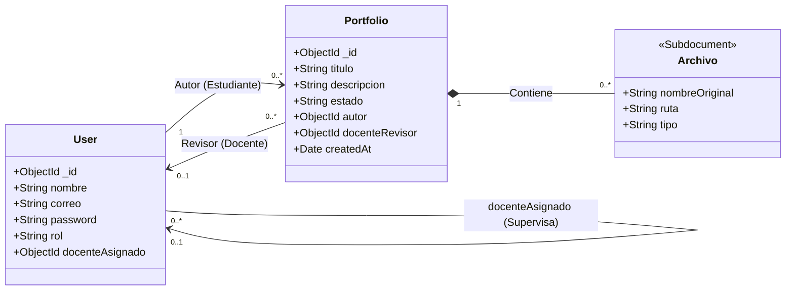
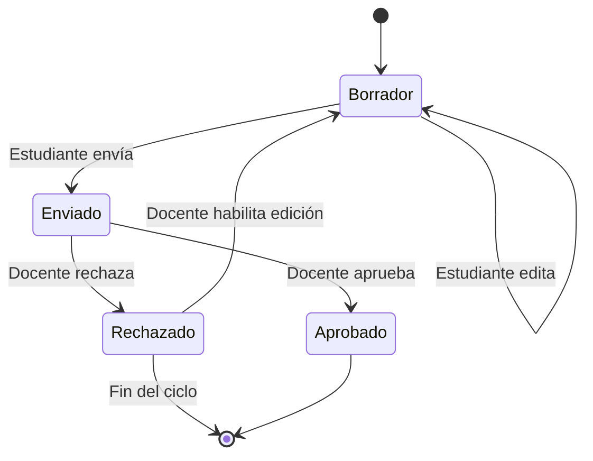
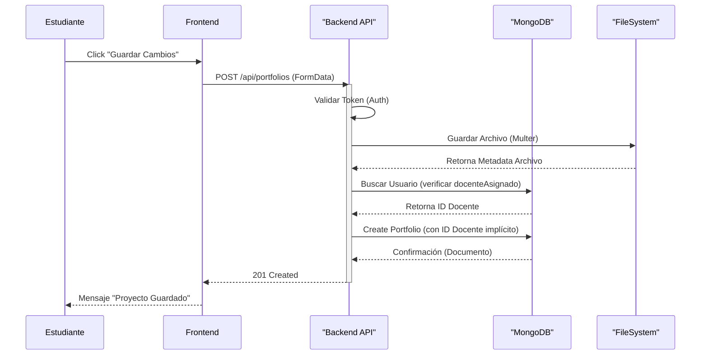
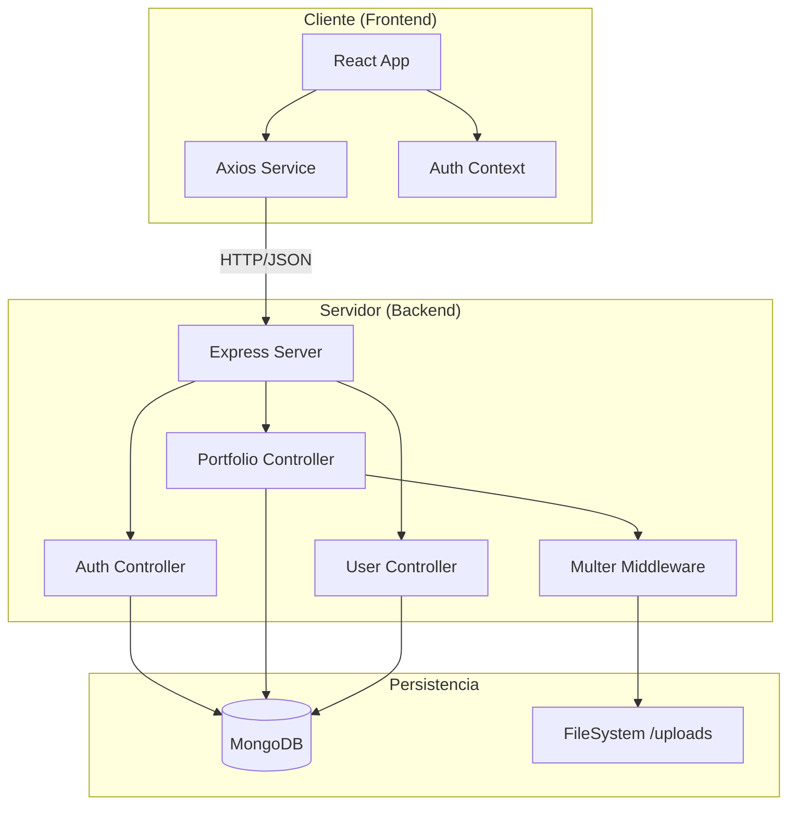
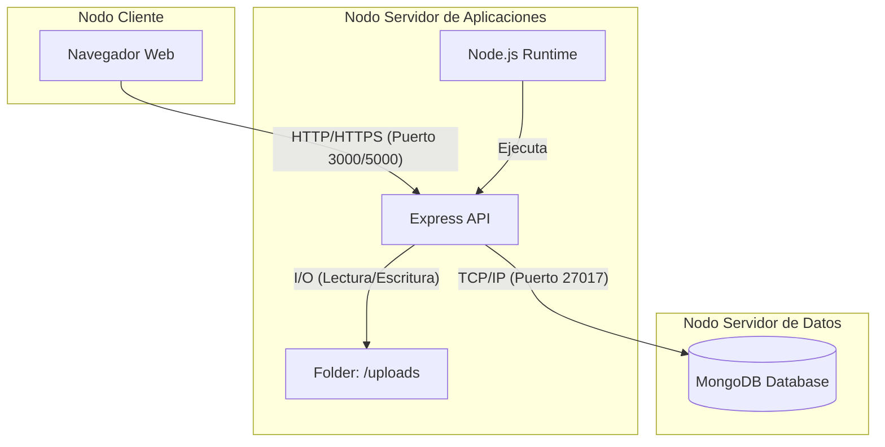
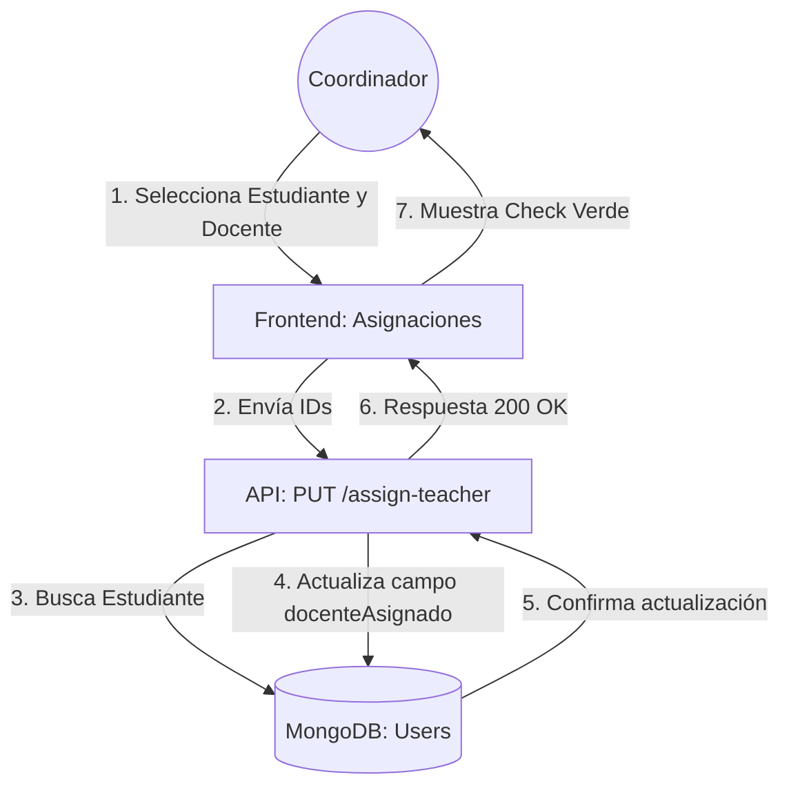

# 📊 Diagramas del Sistema SGP (Mermaid)

Este documento contiene la definición técnica de los diagramas del sistema. La sintaxis ha sido validada para ser compatible con la mayoría de los renderizadores Mermaid.

---

## 1️⃣ Diagrama de Casos de Uso
Describe las funcionalidades disponibles para cada rol (Actor) y sus interacciones con el sistema.

El diagrama de casos de uso representa las funcionalidades principales del Sistema de Gestión de Portafolios Académicos y las interacciones de los diferentes actores con la plataforma.

```mermaid
graph TD
    %% Estilos Globales
    classDef actor fill:#ffffff,stroke:#000000,stroke-width:2px;
    classDef usecase fill:#ffffff,stroke:#000000,stroke-width:1px,rx:20,ry:20;

    %% Actores (Fuera del límite del sistema)
    Estudiante["👤<br/>Estudiante"]:::actor
    Docente["👤<br/>Docente"]:::actor
    Coordinador["👤<br/>Coordinador"]:::actor

    %% Límite del Sistema
    subgraph Sistema ["Sistema de Gestión de Portafolios"]
        direction TB
        
        %% Grupo Acceso
        UC1([Registrarse]):::usecase
        UC2([Iniciar Sesión]):::usecase
        UC3([Recuperar Contraseña]):::usecase
        
        %% Enlace invisible para orden vertical
        UC2 ~~~ UC4

        %% Grupo Estudiante
        UC4([Crear Portafolio]):::usecase
        UC5([Subir Archivos]):::usecase
        UC6([Enviar a Revisión]):::usecase
        UC7([Ver Mis Portafolios]):::usecase
        
        %% Enlace invisible
        UC7 ~~~ UC8

        %% Grupo Docente
        UC8([Ver Asignados]):::usecase
        UC9([Descargar Archivo]):::usecase
        UC10([Evaluar Proyecto]):::usecase
        UC11([Realizar Observaciones]):::usecase
        
        %% Enlace invisible
        UC11 ~~~ UC12

        %% Grupo Coordinador
        UC12([Ver Estadísticas]):::usecase
        UC13([Gestionar Asignaciones]):::usecase
        UC14([Listar Todos]):::usecase
    end
    
    %% Estilo del límite del sistema
    style Sistema fill:#f9f9f9,stroke:#333,stroke-width:2px,stroke-dasharray: 5 5

    %% Relaciones (Cruzando el límite)
    Estudiante --> UC1
    Estudiante --> UC2
    Estudiante --> UC3
    Estudiante --> UC4
    Estudiante --> UC5
    Estudiante --> UC6
    Estudiante --> UC7
    Estudiante --> UC9

    Docente --> UC2
    Docente --> UC3
    Docente --> UC8
    Docente --> UC9
    Docente --> UC10
    Docente --> UC11

    Coordinador --> UC2
    Coordinador --> UC3
    Coordinador --> UC9
    Coordinador --> UC12
    Coordinador --> UC13
    Coordinador --> UC14
```

---

## 2️⃣ Diagrama de Clases
Representa la estructura de datos (Modelo) y las relaciones entre entidades del sistema.

---

## 3️⃣ Diagrama de Estados (Portafolio)
Muestra el ciclo de vida y las transiciones de estado de un proyecto académico.

---

## 4️⃣ Diagrama de Secuencia
Detalla la interacción temporal de objetos durante el **Envío de un Portafolio**.

---

## 5️⃣ Diagrama de Componentes
Describe la arquitectura de software, módulos y sus dependencias.

---

## 6️⃣ Diagrama de Despliegue
Representa la distribución física de los artefactos de software en los nodos de ejecución.

---

## 7️⃣ Diagrama de Colaboración
Enfocado en la interacción entre objetos para el proceso de **Asignación de Docente**.

